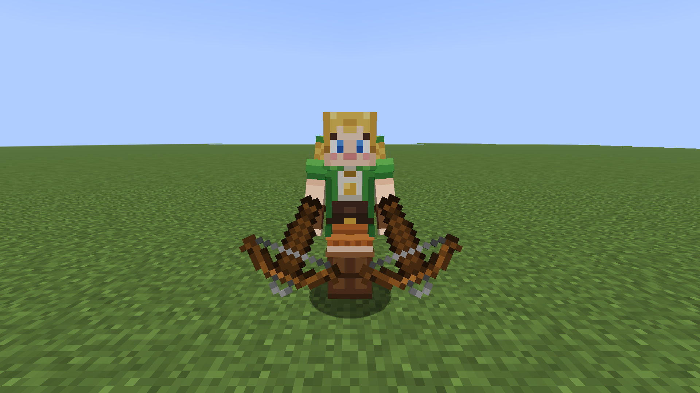
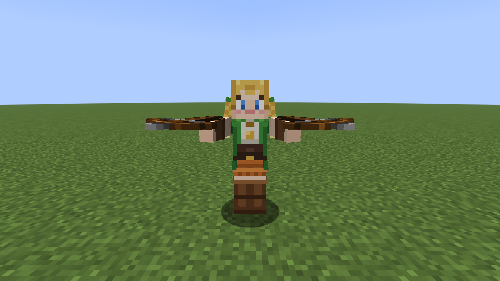
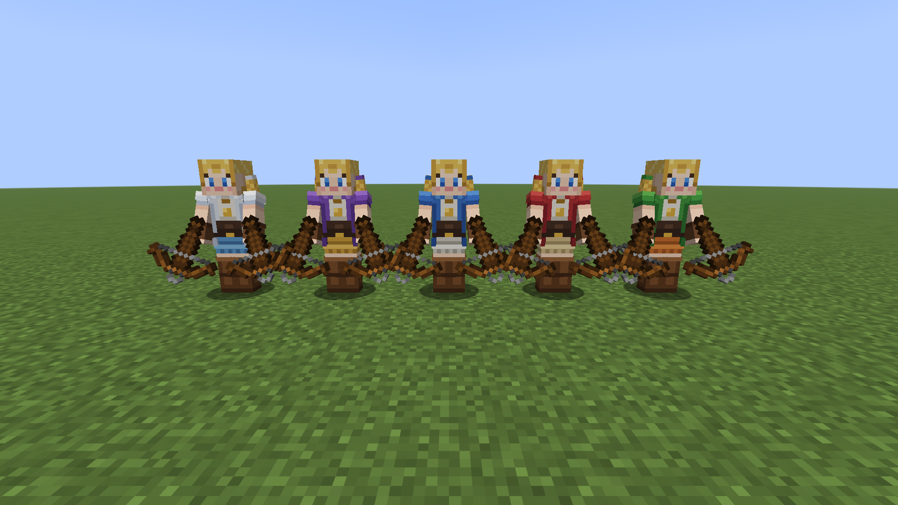
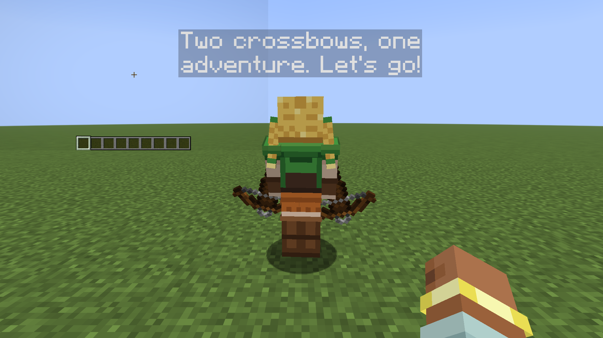
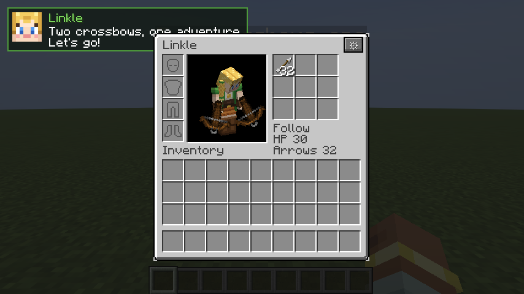
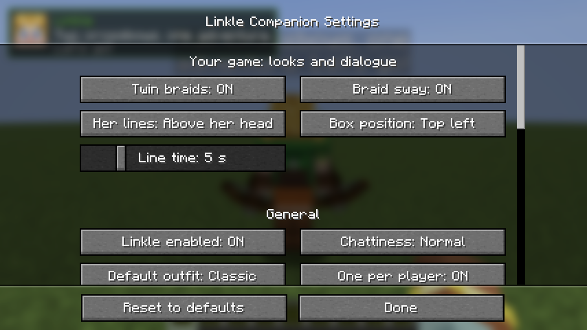
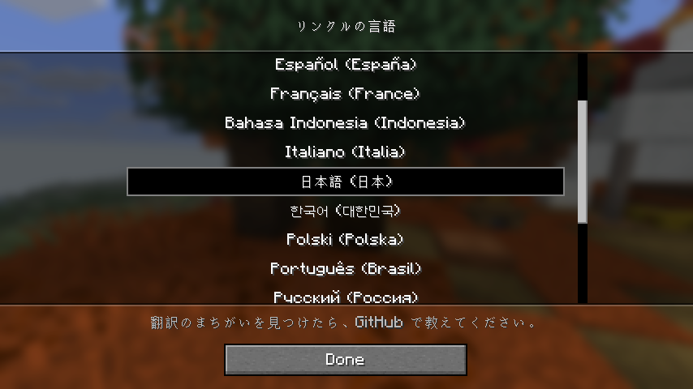

<p align="center"></p>

# Linkle Companion

[](https://modrinth.com/mod/linkle-companion)
[](https://www.curseforge.com/minecraft/mc-mods/linkle-companion)
[](https://github.com/JheanSan/linkle-companion/actions/workflows/build.yml)


[](LICENSE)

A Fabric mod for Minecraft **26.1, 26.2 and 26.3** that adds **Linkle**, a dual-crossbow companion who follows you,
fights beside you and talks to you.

> **Unofficial fan project.** Linkle is a character from Hyrule Warriors, owned by Nintendo and
> Koei Tecmo. Not affiliated with or endorsed by them. All code, textures and dialogue in this mod
> are original.

| | |
|---|---|
|  |  |
|  |  |
|  |  |

## What's new in 1.2.0

**More Minecraft versions.** Linkle Companion now runs on **Minecraft 26.1, 26.1.1, 26.1.2, 26.2 and
26.3**. Each version has its own download; see [Supported versions](#supported-versions).

## What's new in 1.1.0

**Linkle speaks your language.** She now talks in 16 languages, and a new **Mod language** button at
the top of her settings lets you pick one (or "Same as game"). It only changes Linkle's text: her
dialogue, messages, menus, tooltips, hotkeys, advancements and item names. The rest of Minecraft keeps
its own language. See the [changelog](CHANGELOG.md) for everything.



## Features

- **A real companion**: one Linkle per player, saved with your world, works in single player,
  LAN and on dedicated servers.
- **Follows you everywhere**: keeps a comfortable distance, jogs to catch up, teleports when she
  falls behind or gets stuck (in a hole, behind water) for a few seconds, goes through portals with you, opens doors, avoids lava, fire and cliffs, and steps
  aside when you walk into her in tight spaces.
- **Three modes** (right-click her): **Follow**, **Stay** (she sits and waits) and **Guard**
  (she holds the spot and defends the area around it).
- **Dual crossbows**: she loads one crossbow, then the other, raises both and fires a double shot.
  She keeps her distance, strafes, and backs off when enemies get close. She targets whatever is
  attacking you first.
- **Twin Cyclone**: when enemies crowd her, she spins and fires a ring of twelve bolts (20 second
  cooldown).
- **Never hurts friends**: no friendly fire on you, your teammates, anyone's pets, villagers or golems.
  She won't shoot if a friend is in the way.
- **Knocked out, not dead**: when she runs out of health she falls over for a minute and then gets
  back up, or right away if you give her food. (Real death can be turned on in the config.)
- **Inventory**: 9 pocket slots plus armor slots (sneak + right-click). She uses arrows from her
  pockets, eats food when hurt, and picks up arrows lying next to her.
- **Personality**: short original lines when night falls, when she's hurt, when you're hurt, when you
  enter a new kind of biome, after a big fight, when you feed her... shown in a speech bubble above
  her head (or a corner box with her face, or the action bar). Cooldowns keep her from chattering too much.
- **Idle life**: she looks at you, glances around, checks her crossbows, sits down in Stay mode.
- **Looks**: the player model with slim arms, an original skin, twin braids that sway as she moves,
  and four extra outfits (crimson, azure, violet, snow).
- **16 languages**: English, Deutsch, Español, Français, Italiano, 日本語, 한국어, Polski,
  Português (Brasil), Русский, Türkçe, Українська, Tiếng Việt, Bahasa Indonesia, 简体中文, 繁體中文.
  Pick hers in the settings, independent of the game's language.
- **Light on performance**: vanilla AI, expensive checks run at most once a second, nothing heavy
  runs while she's idle, vanilla sounds and particles only.

## Supported versions

| Minecraft | Download (file name ends in) | Fabric API |
|---|---|---|
| 26.3 | `+mc26.3.jar` | 0.161.0 or newer |
| 26.2 | `+mc26.2.jar` | 0.161.0 or newer |
| 26.1, 26.1.1, 26.1.2 | `+mc26.1.jar` | 0.145.1 or newer |

Launchers (Prism, Modrinth App, CurseForge) pick the right file for your instance automatically. Every
version has the same features and languages. On 26.1.x the `/linkle` permissions use the vanilla
operator levels only (no permission-mod support there). Older versions such as 1.21.x and 1.20.1 aren't
supported.

## How to play

1. Craft a **Wanderer's Compass** (it appears in your recipe book once you have a compass or a
   crossbow):

   | | | |
   |:---:|:---:|:---:|
   | | 🟩 Green dye | |
   | 🏹 Crossbow | 🧭 Compass | 🏹 Crossbow |
   | | 🟨 Gold ingot | |
2. Use it. Linkle appears next to you with 32 arrows.
3. Use the compass again any time to call her back to you. It isn't used up.

### Controls

| Action | What happens |
|---|---|
| Right-click Linkle | Switch mode: Follow -> Stay -> Guard -> Follow |
| Sneak + right-click (or **J**) | Open her inventory: armor + 9 pockets, take or give anything |
| Right-click with food | Feed her (heals, wakes her up when knocked out, or she saves it for later) |
| Right-click with arrows | Hand her the whole stack |
| Name tag | Rename her. Names ending in an outfit name pick that outfit, e.g. "Azure" or "Linkle Snow" |
| Use the Wanderer's Compass | Summon her, or call her back if she exists |
| Sneak + use the compass | If your Linkle is lost in an unloaded area: summon a new one (the old one leaves) |

### Hotkeys
Change them in **Options > Controls > Key Binds > Linkle Companion**.

| Key | What it does |
|---|---|
| **G** | Call Linkle to you |
| **H** | Switch her mode (Follow / Stay / Guard) |
| **J** | Open her inventory (within 16 blocks) |
| (unbound) | Open Linkle settings |

### Settings menu
Open it from **Mod Menu** (Mods > Linkle Companion > Configure) if you have Mod Menu, or with the
**⚙ button** in Linkle's inventory (sneak + right-click her). Mod Menu is optional.

- **Your game**: **Mod language** (pick the language of everything Linkle says and shows, or
  "Same as game"), braids on/off, braid sway, where her lines appear (speech bubble above her head,
  corner box, action bar, off), box position and how long lines stay.
- **General**: a master switch (**Linkle enabled**: off = she can't be summoned and an existing
  Linkle sits and pauses), chattiness (quiet / normal / chatty), default outfit, one per player.
- **Following**: follow distances, teleport on/off and distance, follow through portals, guard radius.
- **Combat**: bolt damage, Twin Cyclone on/off and cooldown, infinite arrows, starting arrows,
  picking up arrows.
- **Health**: eat when hurt, real death, knockout time.

Every option has a tooltip, and **Reset to defaults** puts everything back. On someone else's
server the gameplay options are greyed out: the server's config decides there.

### Commands

| Command | Who can use it | What it does |
|---|---|---|
| `/linkle summon` | operators | Summon (or recall) your Linkle without crafting |
| `/linkle recall` | everyone | Bring your Linkle to you |
| `/linkle mode <follow\|stay\|guard>` | everyone | Change her mode |
| `/linkle skin <name>` | everyone | Change her outfit (`classic`, `crimson`, `azure`, `violet`, `snow`, `custom`) |
| `/linkle info` | everyone | Where she is, health, arrows, mode |
| `/linkle dismiss confirm` | everyone | Send her away (her items drop) |

Permission mods can change who may use each command: the nodes are
`linkle_companion.command.<name>`. Vanilla `/summon linkle_companion:linkle` creates a "wild"
Linkle that joins the first player (without a Linkle) who right-clicks her.

## Installing

You need **Minecraft 26.1, 26.2 or 26.3**, **Fabric Loader** and **Fabric API**. You do **not** need Java,
Python or any build tools: launchers bring their own Java.

**Where:** install it on **both** the client and the server. On a server, every player needs the
mod too. A client with the mod can still join servers that don't have it.

### 1. Prism Launcher (the same steps work in forks such as Freesm Launcher)
1. Click **Add Instance**, pick **Minecraft 26.3** (or 26.2, 26.1.x), and under **Mod loader** choose **Fabric**. Click OK.
2. Select the instance, click **Edit** > **Mods** > **Download mods**.
3. Search for **Linkle Companion**, select it, click **Review and confirm** > **OK**.
   Prism adds Fabric API automatically.
4. Click **Launch**.

### 2. Modrinth App
1. Click **+** (Create an instance), pick **Fabric** and **Minecraft 26.3** (or 26.2, 26.1.x), and create it.
2. Open the instance, click **Add content**, search for **Linkle Companion**, click **Install**.
   Fabric API is installed with it.
3. Click **Play**.

### 3. Manual (official launcher)
1. Download the **Fabric installer** from <https://fabricmc.net/use/>, run it, choose
   your Minecraft version (26.3, 26.2 or 26.1.x), click **Install**.
2. Download **Fabric API** for that version from <https://modrinth.com/mod/fabric-api>.
3. Download the **Linkle Companion** file for that version, e.g. `linkle_companion-1.2.0+mc26.3.jar`
   (see [Supported versions](#supported-versions)).
4. Press `Win + R`, type `%appdata%\.minecraft`, press Enter. Open (or create) the `mods` folder and
   put both jar files in it.
5. In the Minecraft Launcher, pick the **fabric-loader-<version>** profile and press **Play**.

### Troubleshooting
- **"Incompatible mods" / "requires minecraft ..."**: the Linkle file doesn't match your Minecraft
  version. Download the file whose name ends in your version (`+mc26.3`, `+mc26.2` or `+mc26.1`).
- **"requires fabric-api"** or the game won't start: Fabric API is missing. Add Fabric API for your version.
- **"requires java >=25"**: your launcher is using an old Java. Prism and the Modrinth App pick the
  right Java automatically; in the official launcher, update the launcher.
- **Can't join a server**: the server and every player need the mod (same version).
- **She doesn't shoot**: give her arrows (right-click her with arrows), or turn on `infiniteArrows`.

## Configuration

The easiest way is the in-game settings menu above. Everything is saved in
`config/linkle_companion.json` (created the first time you play); you never have to edit it by hand. Wrong values are reset to the default with a note in the log.

| Option | Default | Meaning |
|---|---|---|
| `followStartDistance` | 6 | She starts walking toward you beyond this many blocks |
| `followStopDistance` | 3 | She stops when this close |
| `teleportDistance` | 16 | She teleports to you beyond this distance |
| `damageMultiplier` | 1.0 | Damage of her bolts (1.0 = normal crossbow) |
| `infiniteArrows` | false | Never runs out of arrows (bolts can't be picked up) |
| `startingArrows` | 32 | Arrows a new Linkle brings |
| `volleyCooldownSeconds` | 20 | Time between Twin Cyclone volleys |
| `realDeath` | false | Really die instead of being knocked out |
| `knockoutSeconds` | 60 | How long she stays knocked out |
| `guardRadius` | 12 | Area she defends in Guard mode |
| `onePerPlayer` | true | One Linkle per player |
| `defaultVariant` | classic | Outfit of new Linkles |
| `language` | auto | Language of Linkle's text: `auto` (same as the game) or a code such as `de_de`, `ja_jp`, `pt_br` (client) |
| `hairEnabled` | true | Show the twin braids (client) |
| `hairSway` | true | Let the braids sway (client) |
| `dialogueDisplay` | bubble | `bubble` (above her head), `hud` (corner box), `actionbar` or `off` (client) |
| `dialoguePosition` | top_left | `top_left`, `top_center` or `top_right` (client) |
| `dialogueSeconds` | 5 | How long a line stays in the box (client) |
| `enabled` | true | Master switch (off: no summoning, existing Linkle pauses) |
| `chattiness` | normal | `quiet`, `normal` or `chatty` |
| `teleportToOwner` | true | Teleport when left far behind |
| `followThroughPortals` | true | Go through portals with you |
| `volleyEnabled` | true | Use the Twin Cyclone |
| `autoEat` | true | Eat food from her pockets when hurt |
| `pickUpArrows` | true | Pick up arrow items next to her |

## Languages

| | | | |
|---|---|---|---|
| English (`en_us`) | Deutsch (`de_de`) | Español (`es_es`) | Français (`fr_fr`) |
| Italiano (`it_it`) | 日本語 (`ja_jp`) | 한국어 (`ko_kr`) | Polski (`pl_pl`) |
| Português (`pt_br`) | Русский (`ru_ru`) | Türkçe (`tr_tr`) | Українська (`uk_ua`) |
| Tiếng Việt (`vi_vn`) | Bahasa Indonesia (`id_id`) | 简体中文 (`zh_cn`) | 繁體中文 (`zh_tw`) |

By default Linkle uses the game's language. If your game is set to a regional variant without its own
file, she uses the closest one (Español (México) -> Español, Português (Portugal) -> Português (Brasil),
繁體中文 (香港) -> 繁體中文, and so on), otherwise English.

**Found a mistake, or want to add a language?** Translations are plain JSON files in
`src/main/resources/assets/linkle_companion/lang/`. Copy `src/main/generated/assets/linkle_companion/lang/en_us.json`
to your language code (the same codes Minecraft uses), translate the values, keep every `%s`, and open a
pull request. `./gradlew build` checks that no line or placeholder is missing. A resource pack with
`assets/linkle_companion/lang/<code>.json` works too, and its language appears in the picker by itself.

## Skins (use your own look)

Linkle's skins are normal textures, so a resource pack can replace them **on your own machine**.
This mod only ships its own original skins and never bundles other people's work.

1. Make a resource pack folder, e.g. `MyLinkleSkin/`, with a `pack.mcmeta` file:
   ```json
   { "pack": { "description": "My Linkle skin", "min_format": 97, "max_format": 97 } }
   ```
   (97 is the resource pack format of Minecraft 26.3; use your version's number. If the game marks
   the pack as made for another version, it usually still works.)
2. Put your 64x64 player skin (slim-arm "Alex" layout) at
   `MyLinkleSkin/assets/linkle_companion/textures/entity/linkle/custom.png`.
3. Put the folder in `resourcepacks/`, enable it in **Options > Resource Packs**.
4. Rename Linkle with a name tag ending in **Custom**, or use `/linkle skin custom`.

You can also replace `classic.png` (or any outfit) to change the default look.
The braids read their texture from the unused top-right area of the skin, (24,0) to (40,8);
if your skin leaves that area empty the braids are simply invisible. Turn them off with
`hairEnabled: false` if you prefer.

## Building from source

Players don't need this. For developers:

1. Install **JDK 25** (for example Eclipse Temurin).
2. Clone the repository and run:
   ```
   ./gradlew build
   ```
   The mod jar is in `build/libs/`. `build` also runs the server game tests.
   That builds the main version (26.3). For another one add `-Pmc=<version>`, e.g.
   `./gradlew build -Pmc=26.1`; `python scripts/release/make_release_kit.py` builds and tests them all.
   See `docs/VERSIONS.md` for how version support works and how to add a new Minecraft version.
3. Useful tasks: `runClient`, `runServer`, `runDatagen` (recipes, lang, tags, advancements),
   `runClientGameTest` (screenshot showcase and combat play-test), `cleanInstallClient`.
4. Art is generated by scripts (Python 3, no packages needed):
   `python scripts/art/generate_skins.py --preview` and `python scripts/art/generate_items.py`.

See `docs/ARCHITECTURE.md` for a tour of the code.

## License

- Code: **MIT** (see `LICENSE`).
- Original textures and icon: **CC BY 4.0** (see `ASSETS.md`).
- No monetization.

Unofficial fan project. Linkle is a character from Hyrule Warriors, owned by Nintendo and Koei Tecmo.
Not affiliated with or endorsed by them.

## Tools disclaimer

In the spirit of full transparency, here is every tool used to make this mod:

- A **mouse**. 
- A **keyboard**.
- A **monitor**, without which this would have been a very different, much darker project.
- A **chair** for sitting, and a **desk** for holding up all the other tools.
- A **computer**, and electricity, reportedly.
- **AI**, which was used to write the code and the script that draws the textures.
